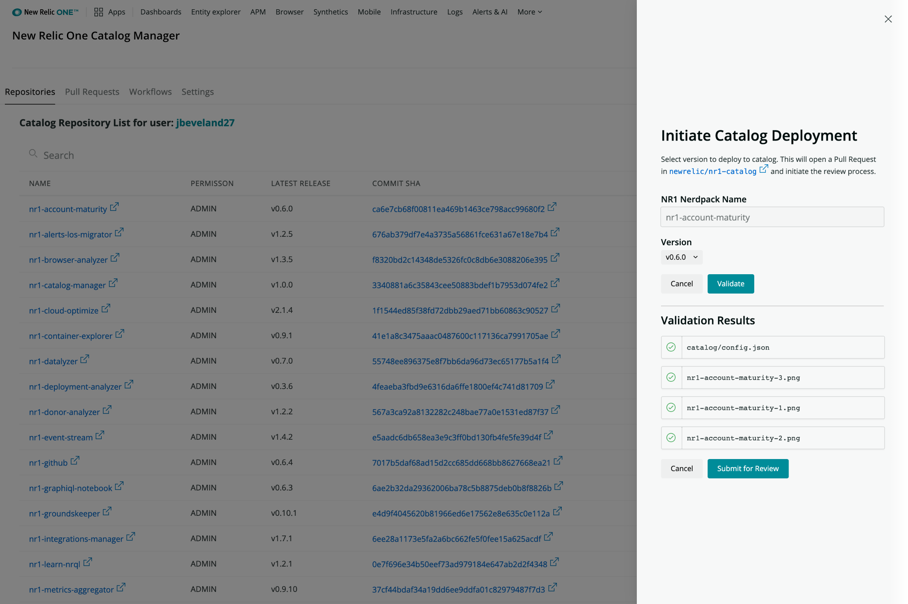

[](https://opensource.newrelic.com/oss-category/#community-project)

# New Relic One Catalog Manager (nr1-catalog-manager)
[](https://github.com/newrelic/nr1-catalog-manager/releases)  [](https://snyk.io/test/github/newrelic/nr1-catalog-manager)

## About this Nerdpack

This project is used by New Relic to manage the collection of open source Nerdpacks that make up the New Relic One Catalog. You can also think of it as the front-end to complement [newrelic/nr1-catalog](https://github.com/newrelic/nr1-catalog). It primarily interacts with GitHub APIs and the [newrelic/nr1-catalog](https://github.com/newrelic/nr1-catalog) repository to accomplish these goals.

Currently, this can be used to view and _initiate_ updates to the Catalog (via a set of GitHub Actions workflows) by generating new Pull Requests to the [nr1-catalog](https://github.com/newrelic/nr1-catalog). You can also view existing Pull Requests to `nr1-catalog`, as well as see the state of Workflows.

## First Time Additions to the Catalog

If you wish to add application to the catalog for the first time you will need to change the application subscription model to `GLOBAL`.

The request to change an application from `owner_and_allowed` (3rd party custom apps) to `GLOBAL` (3rd party global apps) has to be done by a Relic, so please make this request in the form of a new issue in the repo you are developing in. A Relic can then make a request to `#help-nr1-platformservices` via Slack to change the model of the application.

### Request message

@hero `App name`  `version`  `global uuid` : needs to be changed to a `GLOBAL` subscription model.

## Updating NR1 Platform Environments

When making an update to an application in the Catalog this workflow provided by the Catalog Manager will only update the `US:Production` environment of New Relic One. Therefore you will need to make a request to `#help-nr1-platformservices` via Slack to update `EU:Production` and `Staging`

### Request message

@hero `App name`  `version`  `global uuid` : was merged into the master and updated on PROD using the catalog-manager. please update EU and staging.



## Open source license

This project is distributed under the [Apache 2 license](LICENSE).

## What do you need to make this work?

- You will need to set up Personal Access Tokens to allow the communication between repositories to occur.
- Your own version of the [newrelic/nr1-catalog](https://github.com/newrelic/nr1-catalog) repo (whether a fork or a clone)
- Catalog workflows in [your nerdpack repo](https://github.com/newrelic/nr1-browser-analyzer/blob/main/.github/workflows/catalog.yml) and [your catalog reop](https://github.com/newrelic/nr1-catalog/blob/master/.github/workflows/generate-catalog-pr.yml)
- You will need to run `Node 16`

## Getting started

1. Ensure that you have [Git](https://git-scm.com/book/en/v2/Getting-Started-Installing-Git) and [NPM](https://www.npmjs.com/get-npm) installed. If you're unsure whether you have one or both of them installed, run the following commands. (If you have them installed, these commands return a version number; if not, the commands aren't recognized.)
```bash
git --version
npm -v
```
2. Install the [NR1 CLI](https://one.newrelic.com/launcher/developer-center.launcher) by going to [the developer center](https://one.newrelic.com/launcher/developer-center.launcher), and following the instructions to install and set up your New Relic development environment. This should take about 5 minutes.
3. Execute the following command to clone this repository and run the code locally against your New Relic data:

```bash
nr1 nerdpack:clone -r https://github.com/newrelic/{{ NERDPACK_NAME }}.git
cd {{ NERDPACK_NAME }}
nr1 nerdpack:serve
```

Visit [https://one.newrelic.com/?nerdpacks=local](https://one.newrelic.com/?nerdpacks=local) to launch your app locally.

## Deploying this Nerdpack

Open a command prompt in the app's directory and run the following commands.

```bash
# If you need to create a new uuid for the account to which you're deploying this app, use the following
# nr1 nerdpack:uuid -g [--profile=your_profile_name]
# to see a list of APIkeys / profiles available in your development environment, run nr1 credentials:list
nr1 nerdpack:publish [--profile=your_profile_name]
nr1 nerdpack:deploy [-c [DEV|BETA|STABLE]] [--profile=your_profile_name]
nr1 nerdpack:subscribe [-c [DEV|BETA|STABLE]] [--profile=your_profile_name]
```

Visit [https://one.newrelic.com](https://one.newrelic.com), and launch your app in New Relic.

# Support

New Relic has open-sourced this project. This project is provided AS-IS WITHOUT WARRANTY OR DEDICATED SUPPORT. Issues and contributions should be reported to the project here on GitHub.

We encourage you to bring your experiences and questions to the [Explorers Hub](https://discuss.newrelic.com) where our community members collaborate on solutions and new ideas.

## Community

New Relic hosts and moderates an online forum where customers can interact with New Relic employees as well as other customers to get help and share best practices. Like all official New Relic open source projects, there's a related Community topic in the New Relic Explorers Hub. You can find this project's topic/threads here:

https://discuss.newrelic.com/t/{{ APP_NAME }}
*(Note: This URL is subject to change before GA)*

## Issues / enhancement requests

Issues and enhancement requests can be submitted in the [Issues tab of this repository](../../issues). Please search for and review the existing open issues before submitting a new issue.

## Security
As noted in our [security policy](https://github.com/newrelic/nr1-catalog-manager/security/policy), New Relic is committed to the privacy and security of our customers and their data. We believe that providing coordinated disclosure by security researchers and engaging with the security community are important means to achieve our security goals.

If you believe you have found a security vulnerability in this project or any of New Relic's products or websites, we welcome and greatly appreciate you reporting it to New Relic through [HackerOne](https://hackerone.com/newrelic).

# Contributing

Contributions are encouraged! If you submit an enhancement request, we'll invite you to contribute the change yourself. Please review our [Contributors Guide](CONTRIBUTING.md).

Keep in mind that when you submit your pull request, you'll need to sign the CLA via the click-through using CLA-Assistant. If you'd like to execute our corporate CLA, or if you have any questions, please drop us an email at opensource+nr1-catalog-manager@newrelic.com.
